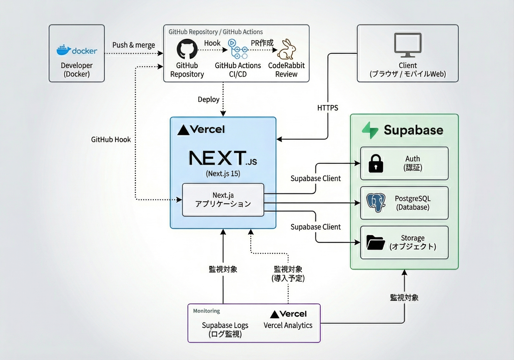

## 🔗 サービスURL / トライアル
下記アカウントでお試しいただくこともできます。
- サービスURL: **https://swim-hub.app/**  
- トライアルアカウント: `test@test.test` / `Pass1234`  


## 📌 サービスへの想い

- 大学水泳部で「練習メニューが伝わらない」「大会結果が共有されない」体験をし、情報の分断を解消したいと考えた。
- 既存アプリは個人利用に偏重しており、**チームの出欠 / お知らせ / 練習管理**まで統合しているサービスが少なかった。
- ターゲットは **個人でもチームでも**使えること。モバイル展開を見据え、API・型を共通化。
- チームでの利用、個人での利用どちらも利用可能。
- 「成長を可視化し、コーチングを効率化する」ことを最終ゴールに設計している。


## アプリケーションのイメージ

 


## 機能一覧
| トップ画面 |　ログイン画面 |
| ---- | ---- |
|  |  |
| サービスの概要について記載した、ブランディング用のLPページです。 | メールアドレスとパスワードでの認証機能を実装しました。 |

| ダッシュボード画面 |　記録入力画面 |
| ---- | ---- |
|  |  |
| 自分の予定をカレンダービューで確認、登録、編集、削除ができます。 | 大会や練習の結果が入力ができる画面です。 |

| 練習記録一覧画面 |　大会記録一覧画面 |
| ---- | ---- |
|  |  |
| 自分の練習記録を一覧で確認し、ソートやフィルタリングができます。 | 自分の大会の記録を一覧で確認し、ソートやフィルタリングができます。 |

| マイページ画面 |　チーム詳細画面 |
| ---- | ---- |
|  |  |
| 自分のプロフィールの編集、ベストタイム表の確認ができます。 | チームのadminであれば、お知らせの発報やチームメンバーの練習、大会記録の一括代理登録等ができます。 |

<br />


## 技術スタック

| Category | Technology Stack |
| --- | --- |
| Frontend | TypeScript 5, Next.js 15 (App Router), React 19, Tailwind CSS 4|
| Backend | Supabase Auth / Storage / Realtime, Row Level Security |
| Infrastructure | Vercel (web), Supabase (DB/Storage) |
| Database | PostgreSQL (Supabase) |
| Monitoring | Supabase Logs, Vercel Analytics（導入予定） |
| Environment setup | Supabase CLI, npm scripts |
| CI/CD | GitHub Actions, CodeRabbit Review |
| Design | Figma（UIモック）, Lucidchart（フロー図） |
| test | Playwright, Vitest |
| etc. | Cursor-MCP, ESLint, Prettier, Husky, Git, GitHub |

---

## アーキテクチャ

```
swim-hub/
├── apps/
│   ├── web/ (Next.js 15, App Router)
│   ├── mobile/ (React Native + Expo, 開発予定)
│   └── shared/（API, hooks, typesを共通化）
├── supabase/（DDL, seeds）
└── docs/（仕様, ルール, 開発プロセス）
```

## システム構成図


## データベース / ER 図


RLSを全テーブルに適用し、`user_id` や `team_id` でマルチテナント制御。<br>
  


## AIフレンドリーな開発プロセス

### 1. `.cursor/rules/*.md` によるモード切替

- `00-general.mdc`, `01-development-flow.mdc`, `02-tech-stack.mdc`, `03-coding-rules.mdc` で**実装計画 / 実装 / デバッグ**モードを明文化。
- AIに渡すガードレールをMDファイルで管理し、**いつでも同じ基準で対話可能**。

### 2. Spec駆動 + TDD

```
1. specs/ で仕様定義
2. Red: Playwright/Vitestでテスト作成
3. Green: 実装（Supabase + Next.js）
4. Refactor: コード整理
```

- AIが扱いやすいよう、ステップごとに目的と完了条件を明記。

### 3. CodeRabbitによる二重レビュー

- GitHub PRごとに **CodeRabbit** がLLMレビュー ⇒ 人力セルフレビュー ⇒ マージ。  
- バグ観点と文章校正の両方を自動化し、レビューログを可視化。

### 4. MCP (Multi-Context Protocol) 連携

- Cursorの**MCP**を通じて Supabase / docs / テスト結果を直接参照。  
- 仕様やDB定義を即座に引き出せるため、LLMの回答精度が向上。

---

## 今後のロードマップ

本プロダクトは4つのフェーズに分けて、段階的に開発を進めています。<br>
現在はフェーズ2として、チーム機能の開発を進めています。<br>
将来的には目標管理やメンバー内のFB機能、AIを用いた最適なメニュー作成機能の実装等を目指しています。
| フェーズ | 内容 | 状態 |
| --- | --- | --- |
| Phase 1 | 練習・大会の個人データ登録機能 | ✅ |
| Phase 2 | チームでの管理機能 | 🔜 |
| Phase 3 | 目標管理機能 | 計画中 |
| Phase 4 | React Nativeアプリ / オフライン同期 | 計画中 |
| Phase 5 | AIトレーニングプラン提案  | 長期 |

---
最終更新: 2025-11-19

