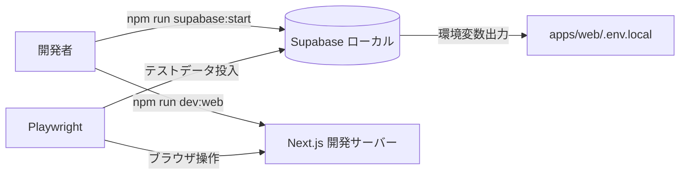

# Playwright E2E 実装計画

## 概要

Playwright を用いた E2E テストを安定運用できるよう、ローカル Supabase を含む実行環境の構築手順を整備しつつ、既存 UI へ `data-testid` を付与してテストシナリオと整合させ、実用的な認証・ダッシュボード系シナリオをグリーンで回せる状態にする。



## ファイル変更計画

- 新規: `docs/PLAYWRIGHT_E2E_SETUP.md`（または `apps/web/e2e/README.md`） - ローカル E2E 実行手順とトラブルシュートを整理
- 新規: `apps/web/e2e/scripts/reset-test-data.js` - Supabase テストデータ再初期化を自動化
- 更新: `apps/web/playwright.config.ts` - Supabase 起動待ち／環境変数読込やローカル専用プロジェクト設定を調整
- 更新: `apps/web/e2e/utils/global-setup.ts` / `global-teardown.ts` / `test-helpers.ts` - テストユーザー生成、データリセット、安定したログインヘルパーを実装
- 更新: `apps/web/e2e/auth.spec.ts`, `apps/web/e2e/dashboard.spec.ts` - シナリオの現実化（ユニークメール、待機改善、失敗時の後片付け）
- 更新: `apps/web/components/auth/AuthForm.tsx` ほかダッシュボード関連 UI コンポーネント・フォーム群 - `data-testid` 追加とテスト用 UI フック整備
- 更新: `apps/web/app/(authenticated)/dashboard/_components/*`, `_client/FormModals.tsx` など - カレンダー操作／モーダルのテストフック整備
- 更新: `supabase/config.toml`（必要なら） - `db.seed.enabled` を開発限定で有効化する等、シード実行性を向上

## 主要実装ステップ

1. Playwright / Supabase / Node 前提条件の確認とドキュメント作成
2. Supabase CLI 設定とシード運用（`supabase db reset` + テストユーザー投入スクリプト）を仕組み化
3. UI コンポーネントへ `data-testid` など E2E 用アクセス手段を追加（Auth・カレンダー・各種モーダル）
4. Playwright ヘルパー＆グローバルセットアップを刷新（ユニークメール生成、データ初期化、既存 API 連携）
5. `auth.spec.ts` / `dashboard.spec.ts` のシナリオ修正と冪等化
6. `npm run test:e2e` 専用スクリプト・結果確認手順を整え、Chromium 単体テストで動作確認 → マルチブラウザ解禁
7. 実行結果・既知の制約をドキュメントへ反映

## 技術的考慮事項

- Supabase ローカルのサービスキー・anon キーは `supabase start` 実行後に `supabase/.env` へ出力されるため、`apps/web/.env.local` へ同期する仕組み／手順が必須
- 既存シード (`supabase/seed.sql`, `test-user-seed.sql`) が重いので、E2E 用の軽量シード or 対象ユーザー限定リセットを導入
- Playwright から Supabase Admin API を叩く際はサービスロールキー取り扱いに注意（`.env.local` の読み込み／CI での秘匿方法を明記）
- UI へ `data-testid` を付与する際は既存スタイルやアクセシビリティへ影響させないよう配慮し、命名規則をドキュメント化
- 複数ブラウザ＆モバイルプロジェクトは開発初期は `chromium` から着手し、安定後に段階的に有効化

## リスクと対策

- Supabase シードが冪等でない → 事前削除クエリ／トランザクションを徹底し、テスト前に `reset-test-data` スクリプトを走らせる
- アカウント重複でサインアップが失敗 → テスト内でタイムスタンプ付きメールを生成し、後始末は Supabase API で削除
- UI の変更がテストの維持コストを押し上げる → `data-testid` の命名規約・ヘルパー利用を標準化し、変更点は一括管理
- Supabase 起動時間が長い → Playwright `webServer` 設定で十分なタイムアウト＆起動前チェックを実装し、失敗時ログを保存

## テスト計画

- E2E テスト: `npm run test:e2e -- --project=chromium`（ローカル Supabase 起動済み／dev サーバー再利用）
- 統合テスト: Supabase シードスクリプト単体で `supabase db reset --workdir supabase` の成功確認
- ユニットテスト: 影響したフォーム／ヘルパーに既存 Vitest があれば再実行（新規は不要想定）

## 前提条件

- Node.js 20 系 + npm 8 以上（ルート `package.json` の `engines` に準拠）
- Supabase CLI 2 系（`npm install -g supabase` または公式手順で導入）
- Playwright 依存のブラウザバイナリは `npx playwright install --with-deps` で取得済みであること
- macOS / Linux を想定（Windows の場合は WSL2 環境での実行を推奨）
- `apps/web/.env.local` に Supabase 接続情報が設定されていること（後述）

## ローカル環境構築手順

1. 依存パッケージのインストール
   ```bash
   npm install
   ```

2. Supabase ローカルの起動  
   ```bash
   npm run supabase:start
   ```
   - 初回起動時は `supabase/.env` が生成されるので、以下のキーを `apps/web/.env.local` に追記する  
     ```bash
     NEXT_PUBLIC_SUPABASE_URL=http://127.0.0.1:54321
     NEXT_PUBLIC_SUPABASE_ANON_KEY=<supabase/.env 内の anon key>
     SUPABASE_SERVICE_ROLE_KEY=<supabase/.env 内の service key>
     ```
   - シードデータをリセットしたい場合は `npm run supabase:reset` を利用

3. Next.js 開発サーバーの起動
   ```bash
   npm run dev:web
   ```

4. テスト用ブラウザ環境のインストール（未実施の場合のみ）
   ```bash
   npx playwright install --with-deps
   ```

## Playwright 実行方法

ローカル Supabase と Next.js が起動済みであることを確認したうえで、プロジェクトルートから以下を実行する。

```bash
# すべてのプロジェクト（chromium / firefox / webkit / mobile）を並列実行
npm run test:e2e

# 開発時は chromium のみに絞ると安定（推奨）
npm run test:e2e -- --project=chromium

# UI モード（失敗箇所を手動確認したい場合）
npm run test:e2e:ui
```

テスト実行後は `apps/web/e2e/playwright-report/index.html` にレポートが生成される。  
レポートをブラウザで確認したい場合は `npm run test:e2e:report` を使用する。

## トラブルシューティング

| 症状 | 対応策 |
| --- | --- |
| Supabase への接続が 404/503 | `npm run supabase:start` が起動済みか、`config.toml` のポートが競合していないか確認 |
| Playwright がログインに失敗する | テストユーザーの重複が疑われる場合は `apps/web/e2e/scripts/reset-test-data.js` で初期化、または Supabase Studio から該当ユーザーを削除 |
| Next.js 起動前にテストが始まり失敗する | `playwright.config.ts` の `webServer.timeout` を延長、あるいは `command` を `npm run dev:web` に合わせてバックグラウンド起動 |
| ブラウザバイナリが見つからない | `npx playwright install --with-deps` を再実行し、依存ライブラリを揃える |
| CI で環境変数が読み込めない | Supabase のキーを CI シークレットに登録し、`NEXT_PUBLIC_SUPABASE_URL` などを設定してからテストを実行 |


